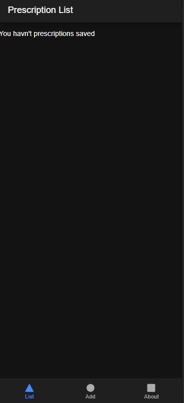
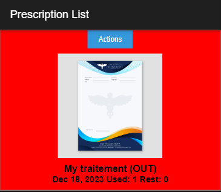
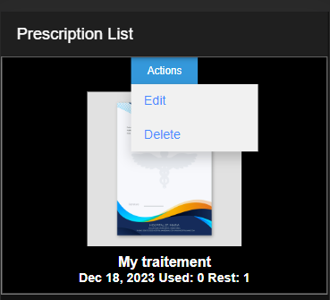
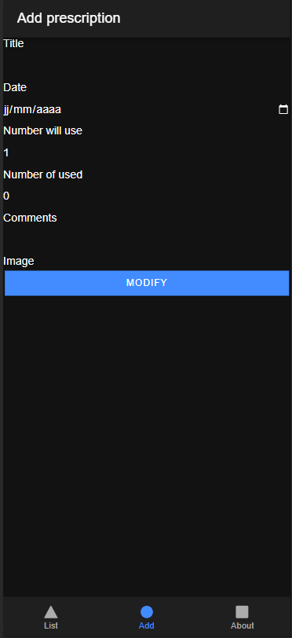
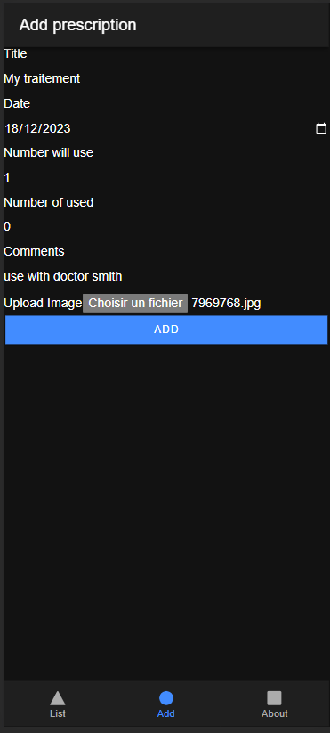
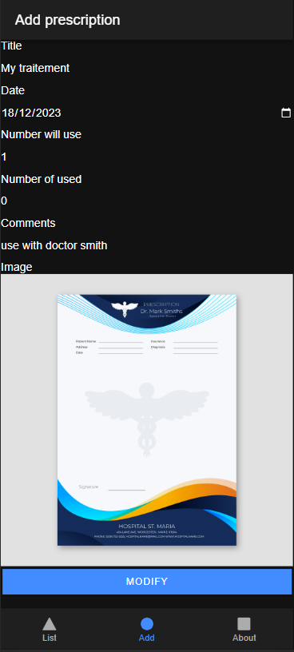
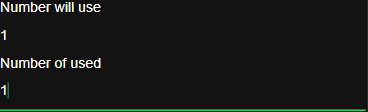

# prescription-helper

mobile application to help you manage your medical prescriptions

## how this application will help me

This application will help you save your medical prescriptions in a structured way on your phone (with a photo of the prescription), and allows you to see at a glance which prescriptions are in progress or out of date.

This system greatly simplifies the management of prescriptions that have to be renewed.

So you have a list of your prescriptions, a form for adding them, and a page dedicated to "about us".

## compatibility

This repository provide only the source code. 
On Windows, you can build this app to Android System.
On MacOs, with XCode, you can build this app to IOS System.

I Will provide APK file (ANDROID) later

## fonctionnality

* List : Medical prescriptions list.
* Add : You can add a medical prescription
* Modify : You can modify a prescription
* Delete : You can delete a prescription
* About : Answer about classic questions ask me

### in the future

In the future i will add to this application :

* Link a prescription to a doctor (with name, address, phone in emergency case)
* Share a prescription (with an other doctor or a drogs store for exemple) using you email client

## Classic Questions

- This app is compatible with me phone ?
    - in theory this app is compatible with Android and IPhone on on mostly mobile. FOr the moment a just tested it on me android (latest) phone (end 2023)
- You catch my personnal data ?
     -i don't catch you nothing data. I can't see you phone settings, prescription, or your personnal datas. me or other
- Where are stored my data ?
    - all your data are stored on your phone only. To be more precise they are stored on  localStorage mobile WebView about this app.
- Who can acces on my mobile device or my data ?
     me or others can't access to your datas. They don't send on internet and rest on your mobile device. that's own
- Whats happend if i delete prescrition helper from me phone ?
    - i don't test yet but i think app's locastorage (place at data are store) will remove. Then you data will be lost

## screenshots

### Empty list of prescriptions

### List with one prescription

### List with one prescription out

### prescription out

### Add prescription form

### Add prescription form filled

### Modify Prescription

### Modify Prescription to will out

